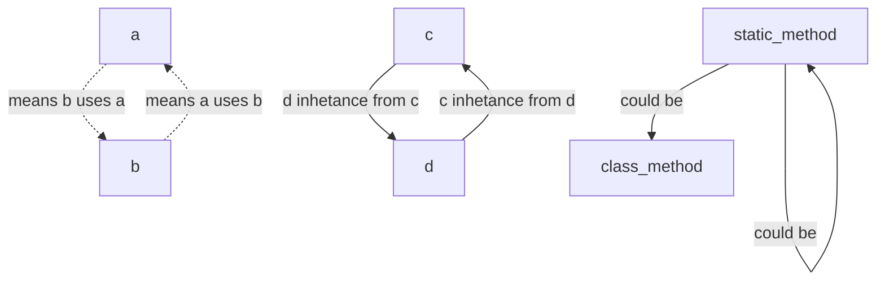

## draw dml classes

note : The dotted arrow from A to B means that B uses A in its operations

```mermaid
graph TD

a -.means b uses a.-> b
b -.means a uses b .-> a

c -- d inhetance from c --> d
d -- c inhetance from d --> c

static_method -- could be--> static_method & class_method


```
draw for api

```mermaid
classDiagram

        
class connection {
  <<connection file>> 
    get_reference_of_received_messages_list()
    get_reference_of_waiting_messages_list()
    get_reference_of_stable_nodes_list()
    get_reference_of_lost_connection()
}

%%-------------------------------------------------
class message  {
  <<message file>>
  set_reference_of_received_messages_list()
  set_reference_of_waiting_messages_list()
  
  get_reference_of_own_received_messages_list()
  get_reference_of_own_waiting_messages_list()
  
}
  
%%-------------------------------------------------
class file  {
  <<messange file>>
  set_reference_of_received_messages_list()
  set_reference_of_waiting_messages_list()
  
  get_reference_of_own_received_messages_list()
  get_reference_of_own_waiting_messages_list()
  
}
  
%%-------------------------------------------------
class compress  {
    <<copress file>>
    
    get_compress_object()
}

%%-------------------------------------------------

class compress  {
    <<object>>
    
    aliases = dict
    
    read_block()
    
    

}

%%-------------------------------------------------

class game {
    <<object>>
       
        
}

%%-------------------------------------------------
class snake {
    <<static>>
    
}

%%-------------------------------------------------

```

Each module has an api class and test class
