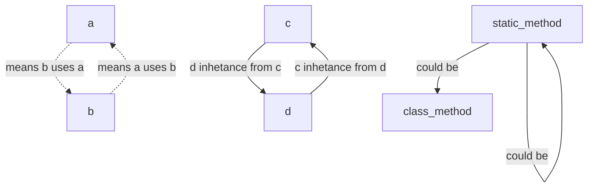

## draw dml classes

note : The dotted arrow from A to B means that B uses A in its operations



```mermaid
classDiagram

        
class locations {
  <<static>> 
  
         # static var
  	 -locations_list = [] :
    -split_ip_and_port = ":"
    -split_items = "-"
    -lock = object from threading.Lokc   
  		#class method()
     + set_ip_port(cls, ip_port)$ 
     + get_ip_and_port(cls, to_str=0):
     - add_to_location_list(cls):
     + avalable_locations(cls):
     + is_this_avalable_ip_port(cls, ip):
     + get_ip_port_not_used(cls):
     + get_passable_ip_port(cls):
     + get_possable_ip(cls):
     + delete_this_location():
     + multi_str_to_tuple(cls, str_):
     + multi_tuple_to_str(cls, list_):
     + to_tuple(cls, ip_port: str) +> tuple:
     + to_str(cls, ip_port: tuple) +> str:
     	 # static method ()
     + get_current_ip():
     + get_possable_ports():


}

%%-------------------------------------------------
class server  {
  <<static>>
  
  # static var
    my_port : first port allow
    server_socket : object tcp socket
  bolean active_server : if bind server
  string current_ip : from location class
  
 #class method()
 +__init__(cls):
 -bind_my_server(cls):
 -server_listen_to_clinets(cls):
 -after_find_peer(cls, clinet_socket, location):
 +get_ip_and_port(cls):
}

%%-------------------------------------------------
class search_other_node{
  <<static>>
  
    +search_all ()
    +search_for_this_node (node)
}
  
%%-------------------------------------------------
class node  {
    <<object>>

    # static var
    node_list = []

    # object var
    ip_port = None
    my_clinet_socket = None
    my_server_socket = None
    message_receve = object message.message
    message_send = object message.message

#obj method()
-set_my_client_socket(self, s):
-set_my_server_socket(self, s):
+get_ip_with_port(self):
(#) send reseve
+send_to_server(self, bytes)
(#) this work with while
-recive_from_clinet(self)
# class method ()
+set_str_location(cls, str_location)
-thread_server_connection_with_client(cls, my_id, socket):
+set_my_clinet(cls, ip_port, sock):
# static method ()
-check_clinet_exist()
-check_server_exitst()

}

%%-------------------------------------------------
class message {
    <<object>>
        part of message :List
        
        (#) object method
        add_this_part_in_linst(self, part)
        is_this_end_part(self, part)
        
        
}

%%-------------------------------------------------
class compress {
    <<static>>
    
    dict_tables = ini compress tables
        (#) object method
        
        compress_message()
        uncompress_message()
        find_candidate_table()
        read_ini()
        #write_ini()
        
}

%%-------------------------------------------------
class command {
    <<static>>
        read_table_command()
        run_command()
        
        

}

%%-------------------------------------------------
class new_game {
        <<static>>
        
        table_pears = peers ini file
        peers_in_game = [theam: locaion]
        
                
        reqist_the_random_location_from_all()
        
        send_final_nomination_for_all()
        
        reqist_final_nomination_from_all()
        
        chose_randomly_location_to_move()
        #to autoer groupe ()
        
        #in connect file i thing ()
                #read_table_pears()
        #write_table_peers()
            

}

%%-------------------------------------------------
class snake {
    <<object>>
    
    staic list_snakes = dict with location
    
    static create_snake(location)
    static delete_snake(location)
    static len(location)
    
    create_snake()
    delete_snke()
    
}

%%-------------------------------------------------
class shape {
    <<object>>
}

%%-------------------------------------------------


locations <..> server

server <.. node

node <..> search_other_node

%%search_other_node <.. settings

node <.. locations

node <|-- message 

%%locations <.. settings

message <..> compress 

message ..> command 

command <..> new_game

new_game <|-- snake 

snake <|-- shape

```