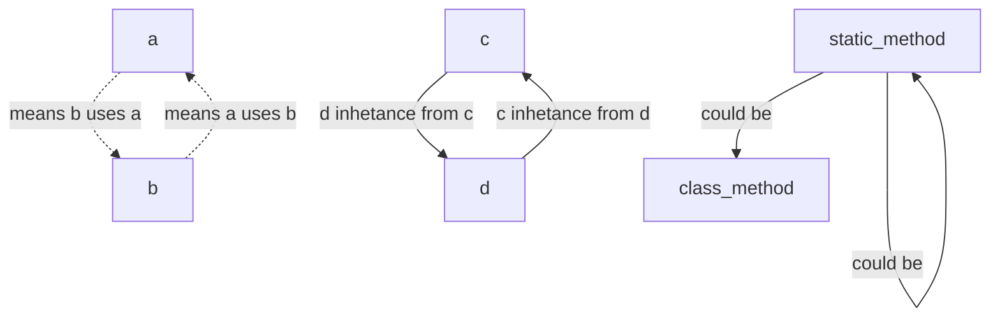
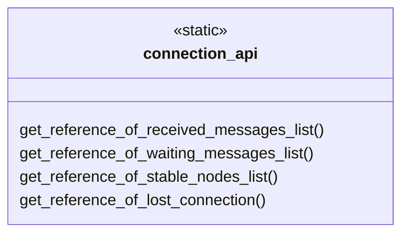
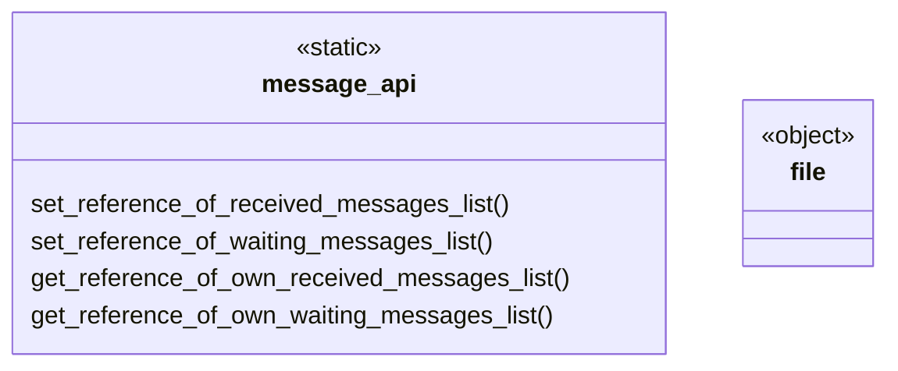
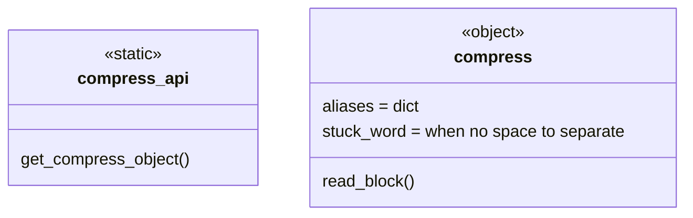
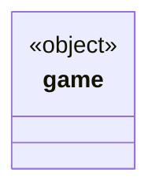
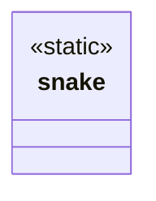

## draw dml classes

note : The dotted arrow from A to B means that B uses A in its operations

draw for api

connection file

messange file

  
 compress file

game file

snake file

Each module has an api class and test class
