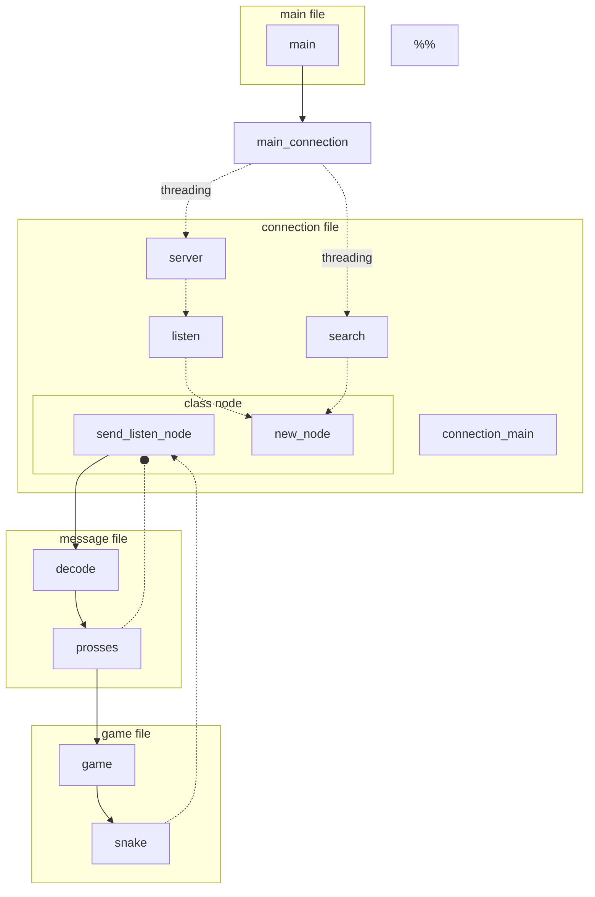
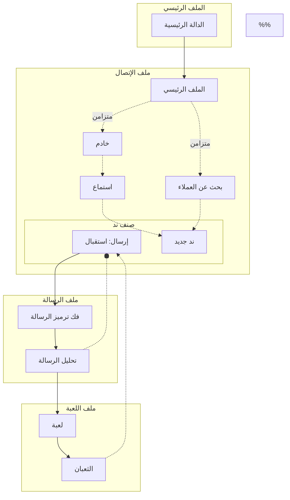

## structure of program

```mermaid
graph TD;
                
        subgraph main file
    main
        end

        subgraph connection file
        connection_main
        server
        listen
        search
        
            subgraph class node
            send_listen_node
            new_node
            end
        
        end

        
        subgraph message file
        decode
        prosses
        end
        
        subgraph game file
        game
        snake
        
        
        end
                
        %% main to connect file
        main --> main_connection
        main_connection -.threading.-> search & server
        listen -.-> new_node
        search -.-> new_node
        server -.-> listen
        
        %% prosses message 
        prosses --> game
        game --> snake
        snake -.-> send_listen_node
        
        
        %% connect file to message file
        send_listen_node --> decode
        decode --> prosses
        prosses -.-o send_listen_node
        
        
        %%

```

in arabic باللغة العربية

```mermaid
graph TD;
                
        subgraph الملف الرئيسي
    main[الدالة الرئيسية]
        end

        subgraph ملف الإتصال
        main_c[الملف الرئيسي]
        server[خادم]
        listen[استماع]
        search[بحث عن العملاء]
        
        subgraph صنف ند
        send_listen_node[إرسال: استقبال]
        new_node[ند جديد]
        end
        
        end

        
        subgraph ملف الرسالة
        decode[فك ترميز الرسالة]
        prosses[تحليل الرسالة]
        end
        
        subgraph ملف اللعبة
        game[لعبة]
        snake[الثعبان]
        
        
        end
                
        %% main to connect file
        main --> main_c
        main_c -.متزامن.-> search & server
        listen -.-> new_node
        search -.-> new_node
        server -.-> listen
        
        %% prosses message 
        prosses --> game
        game --> snake
        snake -.-> send_listen_node
        
        
        %% connect file to message file
        send_listen_node --> decode
        decode --> prosses
        prosses -.-o send_listen_node
        
        
        %%


```