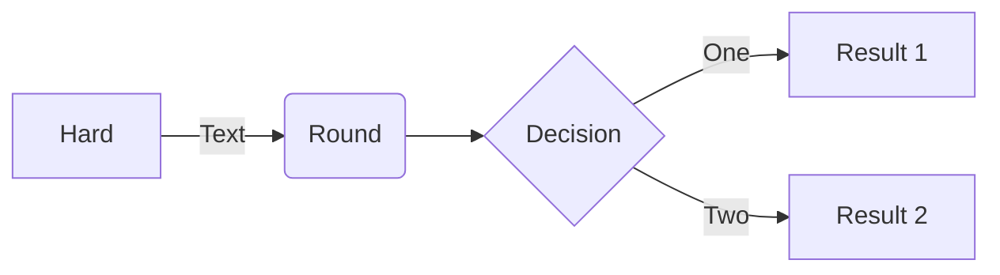
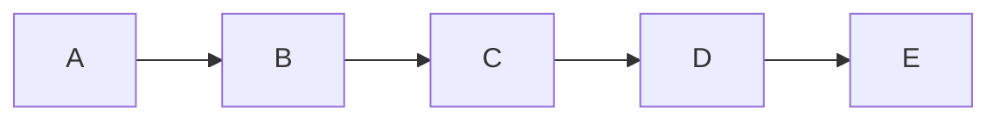
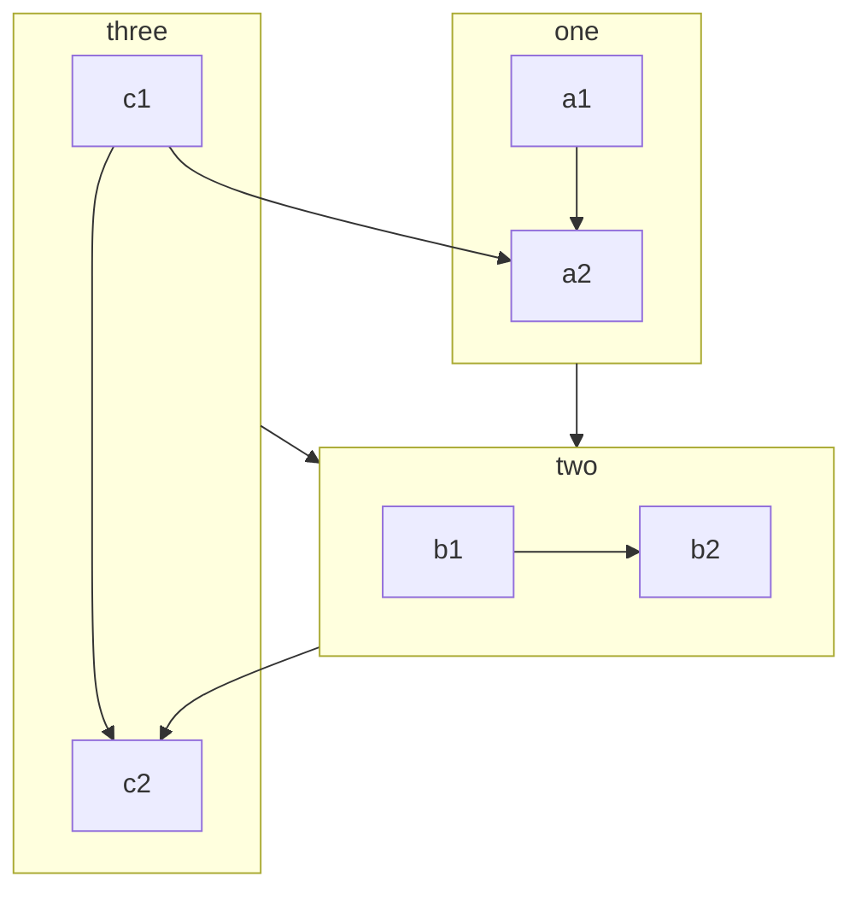
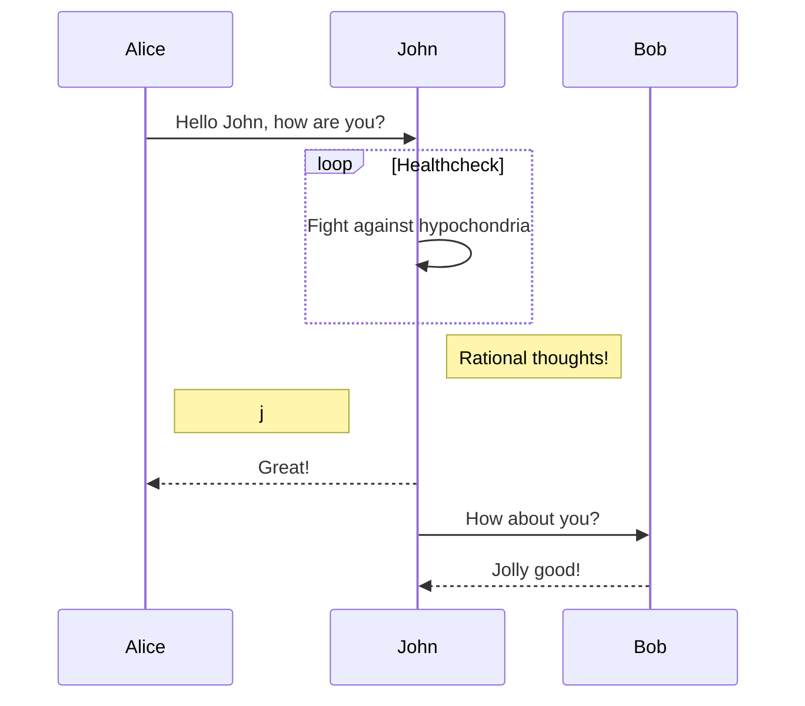
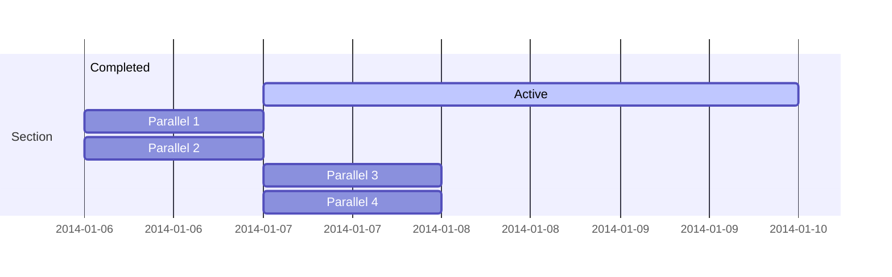
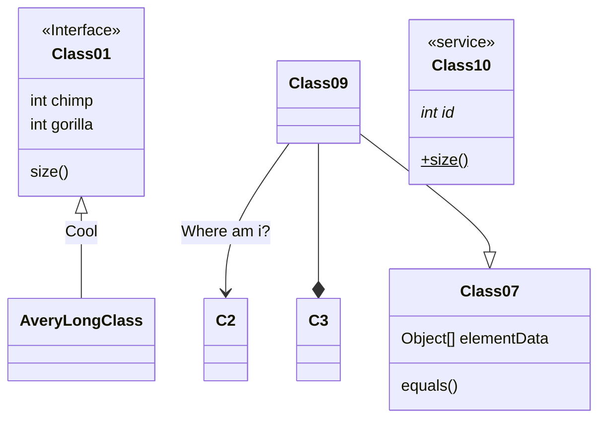
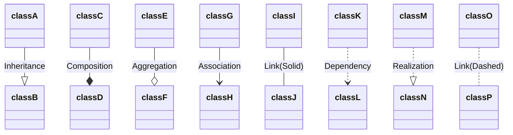
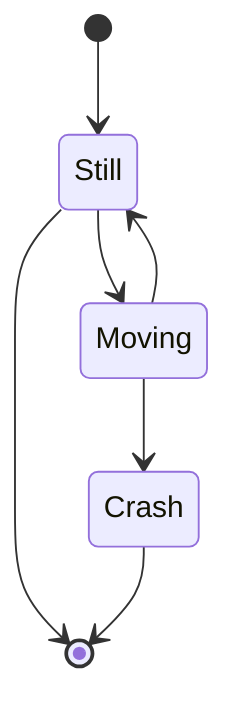
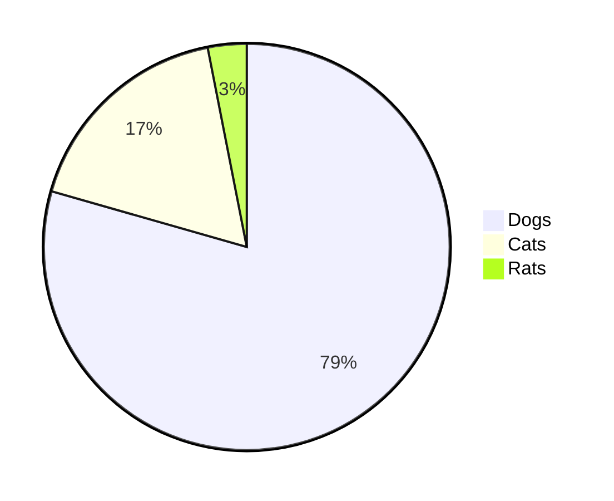
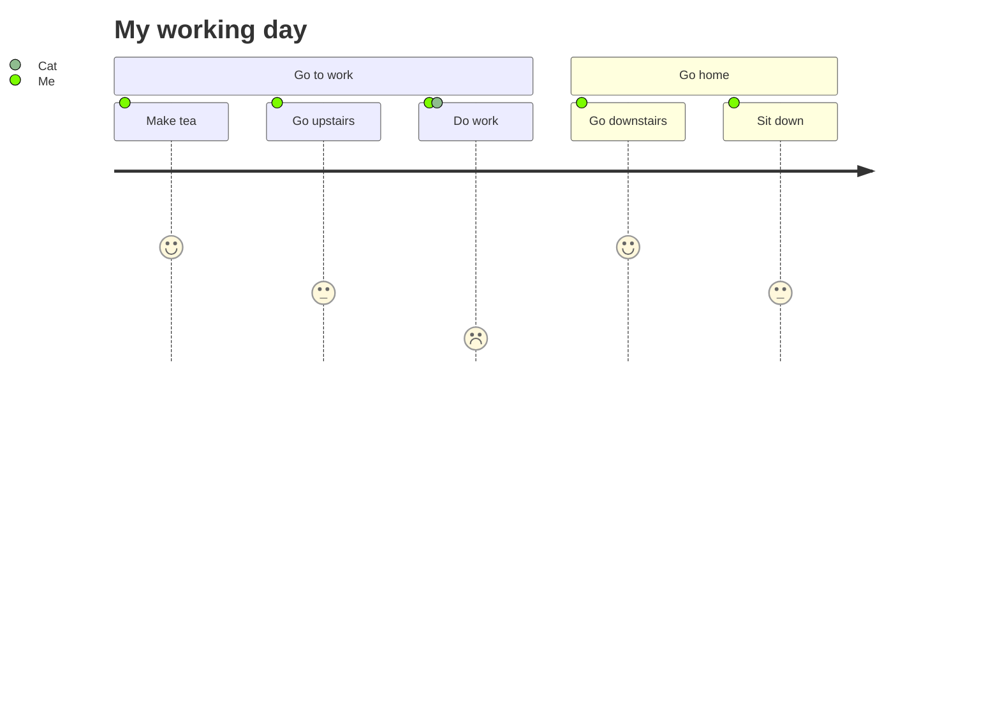

mermaid docks

fore study it[](https://mermaid-js.github.io/mermaid/#/flowchart)



* * *



* * *



* * *



* * *



* * *



```
classDiagram
classA --|> classB : Inheritance
classC --* classD : Composition
classE --o classF : Aggregation
classG --> classH : Association
classI -- classJ : Link(Solid)
classK ..> classL : Dependency
classM ..|> classN : Realization
classO .. classP : Link(Dashed)

Visibility


    + Public
    - Private
    # Protected
    ~ Package/Internal

        * Abstract e.g.: someAbstractMethod()*
        $ Static e.g.: someStaticMethod()$

                && with var
        $ Static e.g.: String someField$
```

* * *

دراسة المزيد حول هذه الأنواع



رسم الحالة



* * *

رسم شطيرة



رسم احصاء

