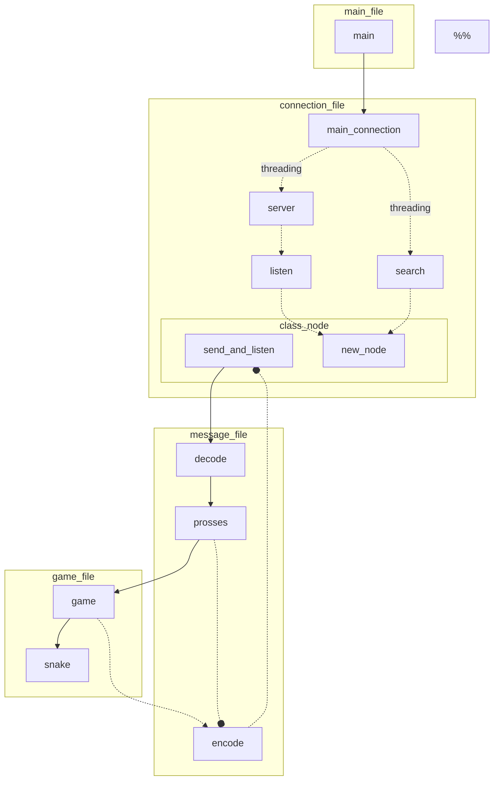
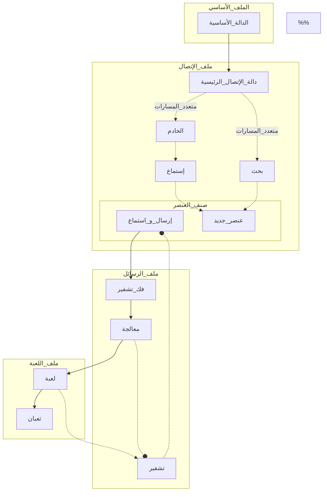

## a_summary_of_how_the_program_works

```mermaid
graph TD;

subgraph main_file
main
end

subgraph connection_file
main_connection
server
listen
search

subgraph class_node
send_and_listen
new_node

end

end


subgraph message_file
decode
encode
prosses
end

subgraph game_file
game
snake


end

%% main to connect_file
main --> main_connection
main_connection -. threading .-> search & server
listen -.-> new_node
search -.-> new_node
server -.-> listen

%% prosses message
prosses --> game
game --> snake
game -..-> encode


%% connect_file to message_file
send_and_listen --> decode
decode --> prosses
encode -.-o send_and_listen
prosses -.-o encode

%%


```
---
## ملخص_لكيفية_عمل_البرنامج

```mermaid
graph TD;

subgraph الملف_الأساسي
الدالة_الأساسية
end

subgraph ملف_الإتصال
دالة_الإتصال_الرئيسية
الخادم
إستماع
بحث

subgraph صنف_العنصر
إرسال_و_استماع
عنصر_جديد

end

end


subgraph ملف_الرسائل
فك_تشفير
تشفير
معالجة
end

subgraph ملف_اللعبة
لعبة
ثعبان


end

%% الدالة_الأساسية to ملف_الإتصال
الدالة_الأساسية --> دالة_الإتصال_الرئيسية
دالة_الإتصال_الرئيسية -. متعدد_المسارات .-> بحث & الخادم
إستماع -.-> عنصر_جديد
بحث -.-> عنصر_جديد
الخادم -.-> إستماع

%% معالجة رسالة
معالجة --> لعبة
لعبة --> ثعبان
لعبة -..-> تشفير


%% ملف_الإتصال to ملف_الرسائل
إرسال_و_استماع --> فك_تشفير
فك_تشفير --> معالجة
تشفير -.-o إرسال_و_استماع
معالجة -.-o تشفير

%%


```
---
